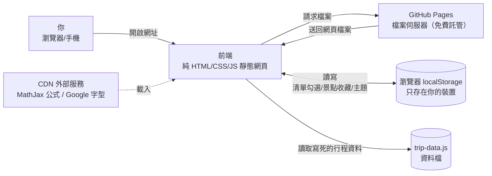

# public-showcase 架構說明（給非工程師）

> 最後更新：2026/08/06

## 這個專案在做什麼？
這是一個**純靜態的展示網站**（意思是網站內容就是一堆現成的網頁檔案，不需要伺服器程式即時運算），用來展示「AI 輔助製作的互動式教科書學習頁面」和實用的網頁元件，目前包含四大區塊：物理波動教材（ch16）、微積分微分教材（ch3）、24 種可重用 UI 元件展示，以及一個全家去東京旅行的「東京旅程中心」網站（河口湖 → 箱根 → 東京，2026/7/19–7/25 七日行程工具）。主要使用場景：把網頁放到 GitHub Pages 上，任何人用瀏覽器打開網址就能閱讀、互動，不需要安裝任何 App。

## 怎麼使用？
1. 用瀏覽器（Chrome、Edge、Safari 等）打開線上網址 `https://brian861114-coder.github.io/public-showcase/`（依 repo 內 `GITHUB_PAGES_DEPLOY.md` 記載）。
2. 首頁是展示入口，有四張卡片：**Chapter 16 Waves 波動**、**Chapter 3 Derivatives 微分**、**All Components 元件展示**、**東京旅程中心**，點卡片即可進入。
3. 教材頁左側有目錄，右側可開起「PDF 原版對照」面板（把課本頁面截圖並排比對）、調整深色模式與閱讀字級、拖曳互動滑桿看公式變化。
4. 東京旅程中心進入後依需求選「查看交通／尋找景點／做好準備／其他工具」，或直接用全站搜尋；行前清單可以勾選，景點可以按 ☆ 收藏。
5. 第一次開啟東京旅程網站後，即使沒網路，已開過的頁面仍可離線觀看（PWA 離線快取）。
6. 手機可把東京旅程「加到主畫面」，它會像 App 一樣全螢幕開啟（manifest.webmanifest 設定）。

## 系統由哪些部分組成？
這個專案**沒有後端伺服器、沒有資料庫**——這是它最重要的特性，原始東京旅程專案有雲端後端，但這個公開展示版已刻意移除（`tokyo_trip/README.md` 有對照表說明）。整個系統只有三層：

- **前端**（你看到的畫面）：全部由 **HTML**（網頁骨架）、**CSS**（外觀樣式）、**JavaScript**（互動行為）三個語言寫成的靜態網頁檔案組成，沒有使用任何框架或打包工具。教材頁共約 443–463 行、東京旅程 15 個內容頁面加 1 份家庭簡報（`ppt/`），共用 `assets/` 底下的共用樣式與程式。
- **檔案伺服器**（負責把網頁檔案送到你瀏覽器的倉庫管理員）：由 **GitHub Pages** 免費託管。GitHub 把 repo（程式碼倉庫）裡的檔案直接當成網站內容伺服出來，repo 裡有 `.nojekyll` 檔（僅在 `tokyo_trip/` 內，避免 GitHub 的 Jekyll 系統忽略底線開頭檔案），表示這是純靜態站。
- **資料存放處**：分兩種，都不是傳統**資料庫**：
  1. `tokyo_trip/assets/trip-data.js`：一個 JavaScript 資料檔，把行程天數、住宿、簡報內容、搜尋索引（約 9.4KB）全部「寫死」在檔案裡，網站資料的「資料庫」其實就是這個檔。
  2. **瀏覽器**的 **localStorage**（瀏覽器內建的小型本機儲存空間）：行前清單勾選狀態（key：`tokyo-checklist`）、景點收藏（key：`tokyo-trip-favorites-v1`）、教材頁深色模式（key：`theme`）都存在**你自己的裝置**上，網站端沒有副本。
- 另外教材頁與部分東京頁面會從外部 **CDN**（內容傳遞網路，提供方代管的檔案伺服器）載入 MathJax 數學公式引擎與 Google 字型，東京旅程有 **Service Worker**（瀏覽器背景代辦程式）與 **PWA**（漸進式網頁應用，可離線使用的網站）機制負責離線快取。

## 資料怎麼流動與儲存？
以「東京旅程的行前清單」為例，完整資料流如下：

1. 你打開頁面，瀏覽器向 GitHub Pages 請求 `packing_checklist.html`，GitHub Pages 把檔案原樣送回（**HTML 採「網路優先」策略**：有網路時先抓最新版，失敗才用快取）。
2. 你勾選「護照」等項目，頁面裡的 JavaScript（`packing_checklist.html` 的 `saveToLocal()` 函式）把勾選狀態寫進瀏覽器的 localStorage（key：`tokyo-checklist`）——**不經過任何伺服器**。
3. 重新整理頁面時，`loadFromLocal()` 從 localStorage 讀回狀態，恢復你勾選的項目與進度條百分比。
4. 若你想搜尋「河口湖」，`search.html` 從 `trip-data.js` 裡的搜尋索引過濾出結果；收藏景點則寫進 localStorage 的 `tokyo-trip-favorites-v1`。
5. 教材頁的公式：瀏覽器向 jsdelivr CDN 載入 MathJax 引擎，把 `$...$` 符號包住的公式即時排版成數學符號顯示——這條路徑**需要網路**，離線時公式會無法顯示。

簡單說：內容（檔案）從 GitHub Pages 流向你的瀏覽器；你的個人操作資料（勾選、收藏、主題）只留在你自己的瀏覽器裡，永遠不會上傳到任何伺服器。

## 登入與權限（如有）
無。網站完全公開、任何人不用登入就能讀取所有頁面；也沒有任何寫入權限的區分——你勾選的清單只有你自己看得到（存在你自己的瀏覽器）。唯一「寫入」動作是主人（Brian）透過 git 把新版檔案推到 GitHub repo，這需要 GitHub 帳號權限，與訪客無關。

## 怎麼安裝到新裝置？
這不是 App，訪客不需要安裝；「部署」是把網站放上網的流程，目前做法（依 `GITHUB_PAGES_DEPLOY.md`）：

1. 準備 GitHub 帳號，建立（或使用現有的）`public-showcase` repo。
2. 把 repo 內容放到本機資料夾；東京旅程是 repo 的子資料夾 `tokyo_trip/`，不是獨立 repo。
3. 每次內容更新後：先在本機用 `npx serve` 起一個本機靜態伺服器預覽（**不要直接雙擊 HTML 檔**，`file://` 會讓部分功能異常）。
4. 有實質內容更新時，把 `tokyo_trip/sw.js` 第一行的快取版本號 `tokyo-trip-gh-v18` 結尾數字 +1（目前是 v18），否則訪客瀏覽器可能暫時顯示舊版。
5. 用 git 的 **commit**（儲存變更記錄）與 **push**（上傳到 GitHub）把檔案推上 repo 的 `main` 分支。
6. 到 GitHub repo 的 Settings → Pages，選擇「Deploy from a branch」、分支 `main`、資料夾 `/ (root)`；等 1–2 分鐘 GitHub Pages 自動部署完成。
7. 驗證：打開線上網址確認入口與各子頁正常。repo 內沒有發現任何 CI（自動化部署）設定檔（`.github/` 不存在），所以這套「改檔 → bump 版本 → push」流程全部是手動的。

## 怎麼備份與還原？
要分開談兩件事：

- **網站本身（檔案）**：GitHub 的 git 歷史就是備份——每一次 push 都留下完整版本記錄，誤刪或改壞任何檔案都可以從歷史恢復；同時 GitHub 雲端也等於異地備份。repo 內未發現任何額外的自動備份機制（無排程、無備份腳本），恢復方式就是 `git checkout` 舊版本。
- **你的個人資料（清單、收藏、主題設定）**：只存在你瀏覽器的 localStorage 裡，**網站端沒有任何副本**。換裝置、清除瀏覽器資料或改用無痕模式都會不見，且沒有匯出功能——這是目前最大的備份缺口，需要手動重新勾選/收藏。

## 外部依賴清單
| 第三方服務 | 用途 | 免費／付費 | 金鑰或帳密放哪裡 | 如果服務倒了或改價會發生什麼 |
|---|---|---|---|---|
| GitHub Pages | 網站託管（把 repo 檔案當網站伺服） | 免費（公開 repo） | 無金鑰；上傳需 GitHub 帳號 | 網站完全無法開啟；解法是搬到任何靜態託管服務，因為檔案都在本機與 git 歷史 |
| jsdelivr CDN | 載入 MathJax 3 數學公式引擎（三個教材頁 `cdn.jsdelivr.net/npm/mathjax@3/...`） | 免費 | 無（CDN 公開網址，寫死在 HTML） | 教材頁公式無法顯示，但頁面其他內容正常；可改掛其他 CDN 或下載自架 |
| Google Fonts | 東京旅程部分頁面（`tokyo_rail.html`、`fuji_hakone_rail.html`、`ppt/assets/fonts.css`）的網頁字型 | 免費 | 無 | 字型退回系統預設字型，排版稍微不同，不影響功能 |
| Google Maps | 景點卡片的「在 Google 地圖查看」連結（`site.js` 產生） | 免費（僅連結跳轉） | 無 | 該按鈕失效或跳錯，不影響網站本身 |
| 原始東京旅程的雲端後端（Cloudflare Worker／D1／OpenAI） | 本 repo 中**不存在**，僅在 `tokyo_trip/README.md` 記載原專案曾有 | — | — | 不適用（本 repo 是無後端靜態副本） |

## 風險提醒
| 風險項目 | 是否適用 | 目前怎麼處理 | 殘留風險 |
|---|---|---|---|
| API 金鑰／密碼外洩 | 否 | repo 內未發現任何 `.env`、金鑰檔或密碼；所有外部服務都是無金鑰的公開 CDN／免費託管 | 無（結構上沒有金鑰可外洩） |
| 資料是否公開 | 是 | repo 已確認公開（GitHub API 回報 `visibility: public`），任何人可瀏覽；內容為教材與行程資訊 | 東京旅程含家庭出遊細節（4 人、日期、住宿名稱、班機時間），屬半私密資訊，公開即永久可見（含 git 歷史）；若在意可改私人 repo 或移除敏感細節 |
| 個人資料蒐集 | 否 | 網站不蒐集、不傳送任何使用者資料；localStorage 資料不離開瀏覽器 | 訪客的瀏覽行為只會被 GitHub Pages 本身記錄（GitHub 的存取統計），非本專案行為 |
| 備份與還原缺口 | 是 | 網站檔案靠 git 歷史備份 | 使用者 localStorage 資料（清單、收藏）無備份、無匯出；清除瀏覽器資料即永久遺失 |
| 金流相關 | 否 | 無任何付款、購物車或金流功能 | 無 |
| 資料庫刪除或遷移 | 否 | 無資料庫；資料在 `trip-data.js`（寫死）與 localStorage | 改行程內容需手動編輯 `trip-data.js` 並重新部署；localStorage 資料結構若改版（schemaVersion）舊資料可能讀不到 |
| 部署與網路暴露 | 是 | 僅暴露靜態檔案；無伺服器程式、無管理介面、無寫入端點 | 網站公開但內容是唯讀檔案，攻擊面很小；唯一風險是 GitHub 帳號被盜導致 repo 被竄改（靠 GitHub 帳號安全機制防護） |
| 日誌含敏感資訊 | 否 | 網站無自己的日誌；未發現任何記錄使用者輸入的程式碼 | 無 |

## 壞了怎麼辦？
依序檢查（也見 `tokyo_trip/GITHUB_PAGES_DEPLOY.md` 的常見問題）：

1. **網站整個打不開**：先確認是不是 GitHub Pages 服務本身出問題（GitHub 狀態頁），或 repo 的 Settings → Pages 是否顯示部署成功；等 1–2 分鐘重新整理。
2. **看到舊版內容**：最常見原因是忘了把 `sw.js` 的快取版本號 +1。強制重新整理（`Ctrl + Shift + R`）；仍舊就在瀏覽器開發者工具的 Application → Service Workers → Unregister（解除註冊）後重新整理。
3. **公式或字型顯示異常**：多半是 jsdelivr／Google Fonts CDN 暫時故障或離線，稍後重試即可；不影響文字內容。
4. **東京旅程頁面 404**：檢查連結是否都是**相對路徑**（例如 `trip_timeline.html`，不以 `/` 開頭）；確認入口是 `tokyo_trip/index.html`。
5. **本機預覽異常**：確認是用 `npx serve` 起 HTTP 伺服器，不是直接雙擊檔案（`file://` 下 Service Worker 與部分功能會失效）。

自動糾錯機制：**沒有**監控告警、沒有健康檢查、沒有自動重啟（靜態站也不需要）。唯一的「自動」機制是 Service Worker：新版上線後，訪客下次進站時瀏覽器會每小時自動檢查更新，新版接管後頁面會自動重整一次（`site.js` 的 `controllerchange` 監聽）。另外 HTML 採網路優先策略，CDN 離線時內容頁仍可從快取讀取。

## 架構圖

（`tokyo_trip/` 另有 Service Worker 在瀏覽器背景快取頁面，支援離線觀看；無後端、無雲端資料庫。）

## 名詞對照表
| 專有名詞 | 白話解釋 |
|---|---|
| repo（repository） | 程式碼倉庫，存放所有專案檔案的資料夾，GitHub 上的一份專案就是一個 repo |
| 前端 | 你在瀏覽器裡看到的畫面與互動，由 HTML／CSS／JavaScript 組成 |
| 後端 | 在伺服器上處理資料的程式（例如登入驗證、查資料庫）；本專案**沒有**後端 |
| 資料庫 | 有結構地存放大量資料的系統（例如雲端表格）；本專案**沒有**資料庫 |
| HTML | 網頁的骨架語言，定義「頁面上有什麼」 |
| CSS | 網頁的外觀語言，定義「看起來如何」 |
| JavaScript | 網頁的互動語言，定義「按下去會發生什麼」 |
| 靜態網站 | 內容是預先做好的檔案、伺服器只是原樣送出的網站，不需要即時運算 |
| GitHub Pages | GitHub 提供的免費網站託管服務，把 repo 檔案直接變成網站 |
| CDN | 內容傳遞網路，由服務商在全球架設的檔案伺服器，讓網頁能快速載入共用程式庫（如 MathJax） |
| MathJax | 讓網頁能顯示數學公式的 JavaScript 程式庫 |
| localStorage | 瀏覽器內建的本機小儲存空間，資料只存在該裝置、該瀏覽器 |
| Service Worker | 瀏覽器背景執行的程式，負責快取網頁讓網站能離線觀看 |
| PWA | 漸進式網頁應用，具備離線、可加入主畫面等 App 化能力的網站 |
| 快取（cache） | 瀏覽器暫存的網頁副本，用來加速與離線閱讀；版本號 +1 可強迫清掉舊副本 |
| 相對路徑 | 不寫死網址開頭、依目前頁面位置找檔案的路徑寫法，換位置也能運作 |
| git | 記錄檔案修改歷史的版本控制工具 |
| commit | 把目前的變更儲存成一筆歷史記錄 |
| push | 把本機的 commit 上傳到 GitHub repo |
| CI | 持續整合／自動化部署，程式碼一上傳就自動測試或發布；本專案**沒有** |
| Cloudflare Worker／D1 | 雲端伺服器程式與雲端資料庫服務；本專案已移除，僅原專案曾有 |
| schemaVersion | 資料格式的版本編號，格式大改時靠它判斷新舊相容 |
| HTTPS | 加密的網頁傳輸協定，GitHub Pages 自動提供 |
